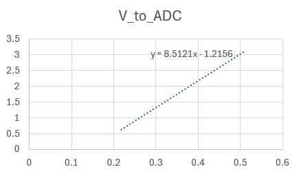
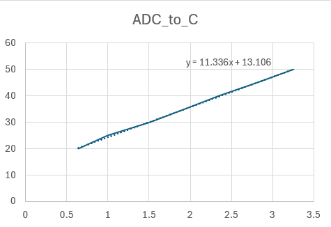
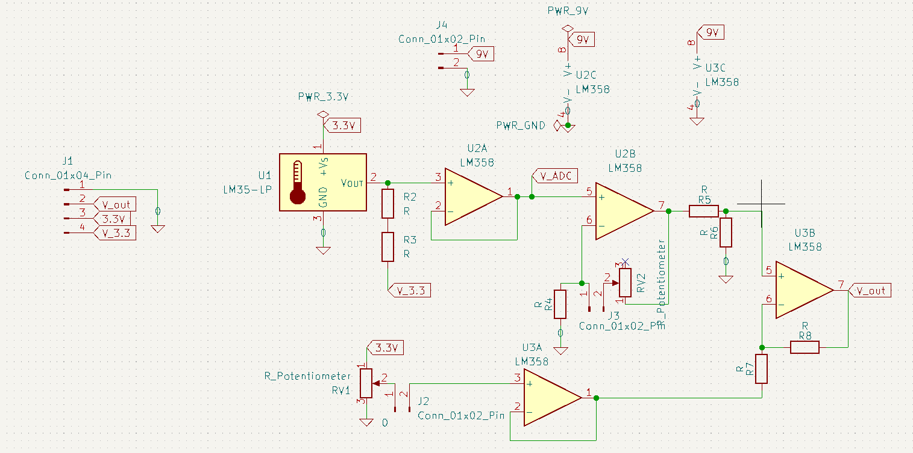
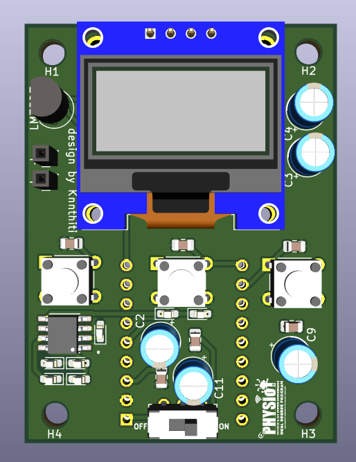
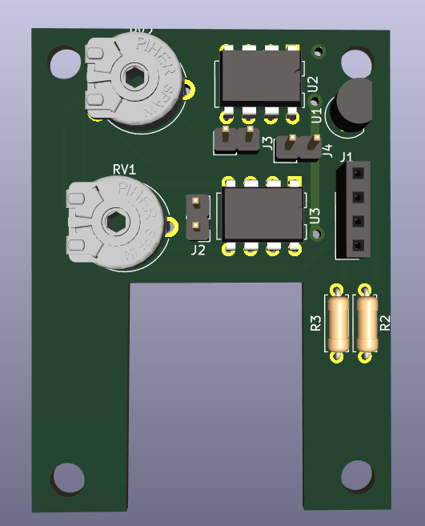

# Zero and Span Adjustment Circuit for LM35 Temperature Sensor

โปรเจกต์นี้เป็นการออกแบบและสร้างวงจรปรับแต่งสัญญาณ (Signal Conditioning) เพื่อแปลงแรงดันจากเซนเซอร์ **LM35** ให้เหมาะสมกับ ADC ของ Microcontroller โดยค่าที่ได้จากการทดลองอยู่ในช่วงประมาณ **0.218V – 0.507V** และแปลงเป็นค่า ADC ได้ประมาณ **0.64 – 3.10**

## 📐 รายละเอียดการคำนวณ (Calculation)

ข้อมูลในหัวข้อนี้อ้างอิงจาก **ผลการทดลองจริง** โดยสามารถดูแหล่งข้อมูลได้จากไฟล์ **กราฟการทดลอง.xlsx**

### 1. วิเคราะห์สัญญาณขาเข้า (Input Analysis)
ค่าที่วัดได้จากการทดลองจริงมีดังนี้:

| อุณหภูมิ (°C) | แรงดัน (V) | ADC |
|---:|---:|---:|
| 50 | 0.507 | 3.10 |
| 45 | 0.454 | 2.82 |
| 40 | 0.403 | 2.35 |
| 35 | 0.355 | 1.94 |
| 30 | 0.312 | 1.51 |
| 25 | 0.253 | 1.00 |
| 20 | 0.218 | 0.64 |

### 2. สมการเส้นตรง (Transfer Function)
ใช้รูปแบบสมการเส้นตรงแบบเดิมคือ
$$y = mx + c$$

โดย
- $m$ คือความชัน (Slope)
- $c$ คือจุดตัดแกน $y$ (Offset)

**2.1 การหาสมการ V_to_ADC**

กำหนดให้ $x = V$ และ $y = ADC$

- แทนค่าจากข้อมูลจริงในไฟล์ **กราฟการทดลอง.xlsx** (ใช้จุดปลายช่วงวัด)
  - จุดที่ 1: $(V, ADC) = (0.218, 0.64)$
  - จุดที่ 2: $(V, ADC) = (0.507, 3.10)$

- **หาค่าความชัน (Slope) แบบเดิม:**
  $$m = \frac{\Delta ADC}{\Delta V} = \frac{3.10 - 0.64}{0.507 - 0.218} = \frac{2.46}{0.289} = 8.5121$$

- **หาค่าออฟเซต (Intercept):**
  แทนค่าใน $y = mx + c$ ด้วยจุด $(0.218, 0.64)$
  $$0.64 = (8.5121 \times 0.218) + c$$
  $$0.64 = 1.8556 + c$$
  $$c = 0.64 - 1.8556 = -1.2156$$

- ตรวจสอบกับเส้นแนวโน้ม (Linear Trendline) จะได้ค่าเดียวกันคือ
  $$m = 8.5121,\; c = -1.2156$$

ดังนั้นสมการคือ
$$ADC = 8.5121V - 1.2156$$

**2.2 การหาสมการ ADC_to_C**

กำหนดให้ $x = ADC$ และ $y = C$

- จากการทำเส้นแนวโน้ม (Linear Trendline) ในไฟล์ **กราฟการทดลอง.xlsx** ได้ค่า
  $$m = 11.336,\; c = 13.106$$

ดังนั้นสมการคือ
$$C = 11.336(ADC) + 13.106$$

**สรุปสมการจากข้อมูลทดลองจริง (พร้อมกราฟ):**

1. **V_to_ADC**
   $$ADC = 8.5121V - 1.2156$$

   

2. **ADC_to_C**
   $$C = 11.336(ADC) + 13.106$$

   

จากภาพด้านบน ค่าที่ใช้ใน README เป็นค่าจริงจากการทดลอง และสามารถตรวจสอบรายละเอียดได้จากไฟล์ **กราฟการทดลอง.xlsx**

---

## 🛠 โครงสร้างและการทำงานของวงจร

วงจรนี้ใช้ Op-Amp **LM358** ในการจัดการสัญญาณ แบ่งออกเป็นส่วนต่างๆ ดังนี้:

- **Sensor Input:** รับสัญญาณจาก LM35-LP ที่ไฟเลี้ยง 3.3V
- **Input Buffer (U2A):** ทำหน้าที่เป็น Voltage Follower เพื่อแยกโหลดออกจากตัวเซนเซอร์
- **Zero Adjustment (U3A):** ใช้ Potentiometer (RV1) เพื่อปรับแรงดันอ้างอิง (Reference Voltage) สำหรับชดเชยค่า Offset
- **Span Adjustment (U3B):** ปรับอัตราขยาย (Gain) เพื่อให้ได้ช่วงแรงดันที่ต้องการ (Span)
- **Output:** สัญญาณ $V_{out}$ จะถูกส่งออกทาง Connector J1

## 📊 ระบบแสดงข้อมูล (Display System)

ระบบแสดงผลถูกแบ่งเป็น 3 โหมดตามปุ่มควบคุม ดังนี้:
- **ปุ่มซ้าย:** เข้าโหมด **WiFi Manager** และเมื่อเชื่อมต่อเครือข่ายสำเร็จ ระบบจะแสดง **IP Address** สำหรับเชื่อมต่อผ่าน **WebSocket**
- **ปุ่มกลาง:** แสดงค่า **อุณหภูมิ** ที่วัดได้จากเซนเซอร์
- **ปุ่มขวา:** แสดงค่า **แรงดันไฟฟ้า** ของสัญญาณที่วัดได้

เป็น Zero and span adjustment circuit :
- **R ตัวบน:** เป็น Rf ปรับกำลังขยาย
- **R ตัวล่าง:** เป็น span ปรับแรงดัน

โค้ดโปรแกรมสามารถดูได้ที่ไฟล์ `T_sensor_V3/T_sensor_V3.ino`

---
